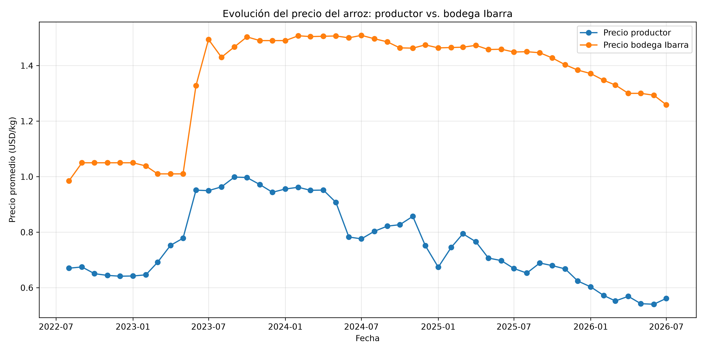
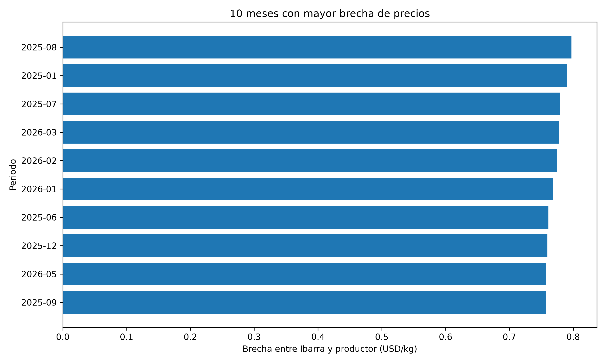
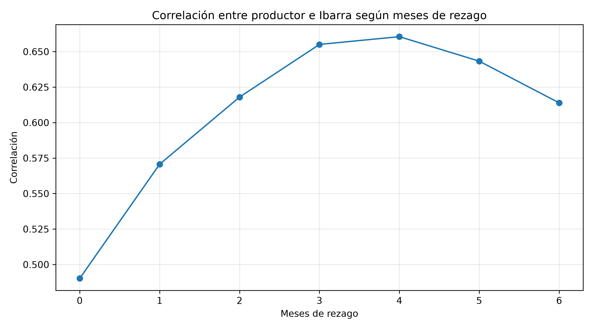
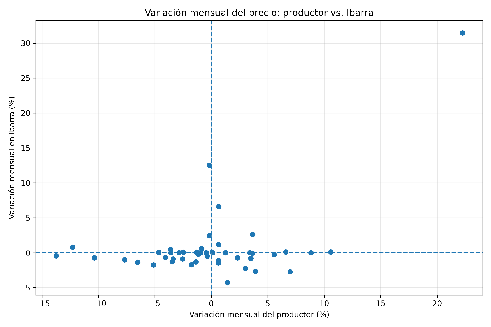
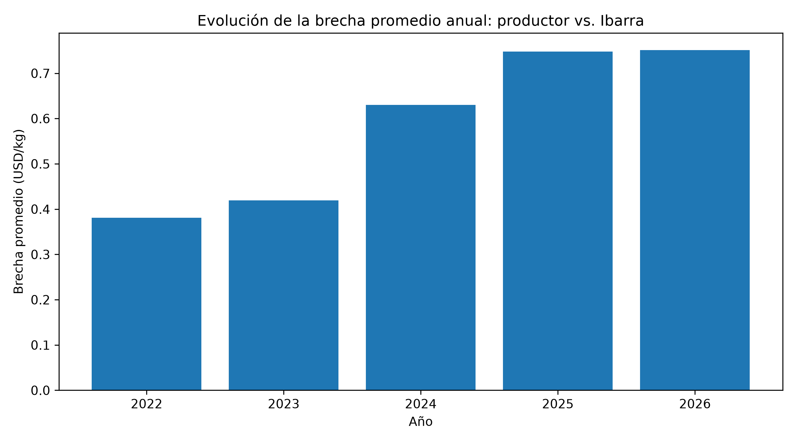

# EDA: Transmisión del precio del arroz entre productor y clientes de Ibarra

## Problema de investigación

El precio del arroz presenta variaciones importantes a lo largo de la cadena de comercialización.

Este proyecto analiza cómo se comporta el precio del arroz desde el nivel productor hasta las bodegas de Ibarra, con el objetivo de identificar si los cambios de precio se transmiten inmediatamente, si existen periodos de mayor separación y si la brecha entre ambos precios se ha ampliado con el tiempo.

## Pregunta principal

**¿Cómo se transmite la variación del precio del arroz desde el productor hasta las bodegas de Ibarra y en qué periodos se amplía la brecha entre ambos precios?**

## Fuente de datos

Los datos fueron obtenidos del Sistema de Información Pública Agropecuaria (SIPA).

Se utilizaron dos bases:

- Precios ponderados al productor.
- Precios de mercados mayoristas y bodegas comerciales.

Para hacer comparables los datos se trabajó con precios expresados en USD por kilogramo.

## Metodología

El análisis se realizó utilizando Python y las librerías:

- Pandas para limpieza y procesamiento de datos.
- Matplotlib para visualización.

El proceso incluyó:

1. Carga de archivos Excel.
2. Limpieza de columnas vacías.
3. Normalización de nombres de productos.
4. Selección de arroz pilado de grano largo.
5. Conversión de año y mes a fechas.
6. Cálculo de precios promedio mensuales.
7. Unión de las bases por fecha.
8. Cálculo de la brecha entre productor e Ibarra.
9. Análisis de correlaciones y rezagos temporales.

---

## Pregunta 1

### ¿El precio en Ibarra responde de forma inmediata a los cambios del precio al productor?

No de forma inmediata.

En los 48 meses comparables, entre agosto de 2022 y julio de 2026, el precio promedio al productor fue de aproximadamente USD 0,75/kg, mientras que en las bodegas de Ibarra fue de aproximadamente USD 1,35/kg. La diferencia promedio fue de USD 0,60/kg.
Además, cuando comparo ambos precios en el mismo mes, la correlación es de aproximadamente 0,49, lo que indica una relación moderada, pero no una respuesta inmediata ni perfecta.

Esto sugiere que la transmisión del precio entre ambos niveles de la cadena no es inmediata ni proporcional.

---

## Pregunta 2

### ¿En qué periodo se produjo el mayor desacople entre el precio al productor y el precio de las bodegas de Ibarra?

La mayor brecha se registró en agosto de 2025.

En ese mes:

- Precio al productor: aproximadamente USD 0,65/kg.
- Precio en Ibarra: aproximadamente USD 1,45/kg.
- Brecha: aproximadamente USD 0,80/kg.
- Diferencia relativa: aproximadamente 122,1 % respecto al precio productor.

Además, los meses con mayores brechas se concentran principalmente entre 2025 y 2026.

---

## Pregunta 3

### ¿Existe un rezago entre el cambio del precio al productor y el precio observado posteriormente en Ibarra?

Sí existe evidencia exploratoria de un posible rezago.

La correlación entre ambos precios es aproximadamente 0,49 cuando se comparan en el mismo mes.

La relación aumenta progresivamente y alcanza aproximadamente 0,66 cuando el precio de Ibarra se desplaza cuatro meses.

Esto sugiere que parte de los movimientos del precio al productor podría reflejarse posteriormente en Ibarra.

Este resultado representa una relación exploratoria y no demuestra causalidad.

---

## Pregunta 4

### ¿Las subidas y bajadas del precio al productor se reflejan de la misma manera en Ibarra?

No siempre.

Aproximadamente el 42,6 % de los meses presentan movimientos en la misma dirección.

Esto significa que en más de la mitad de los meses los movimientos del productor y de Ibarra no coinciden simultáneamente.

El resultado refuerza la posibilidad de que exista una transmisión no inmediata de precios.

---

## Pregunta 5

### ¿La brecha entre productor e Ibarra se ha ampliado de forma sostenida en los últimos años?

Sí.

Entre los años completos analizados, la brecha promedio pasó aproximadamente de:

- 2023: USD 0,42/kg.
- 2024: USD 0,63/kg.
- 2025: USD 0,75/kg.

Esto indica una ampliación importante de la diferencia entre el precio al productor y el precio registrado en Ibarra.

El valor observado en 2026 también es elevado, aunque debe interpretarse con precaución porque corresponde a un periodo parcial.

---

## Conclusiones

El análisis exploratorio muestra que existe una diferencia persistente entre el precio al productor y el precio observado en las bodegas de Ibarra.

La brecha no permanece constante y se amplía especialmente durante 2025 y comienzos de 2026.

También se identificó que la relación entre ambos precios aumenta cuando se introducen rezagos temporales, alcanzando su mayor correlación aproximadamente cuatro meses después.

Estos resultados sugieren que la transmisión de precios a lo largo de la cadena comercial no es inmediata.

Desde una perspectiva empresarial, identificar estos periodos puede apoyar decisiones relacionadas con compras, inventarios y negociación con proveedores.

## Limitaciones

Este análisis es exploratorio.

La brecha calculada no debe interpretarse como margen de utilidad, porque no incluye costos de transporte, almacenamiento, procesamiento, pérdidas ni otros costos de comercialización.

Además, la correlación observada no implica causalidad.
